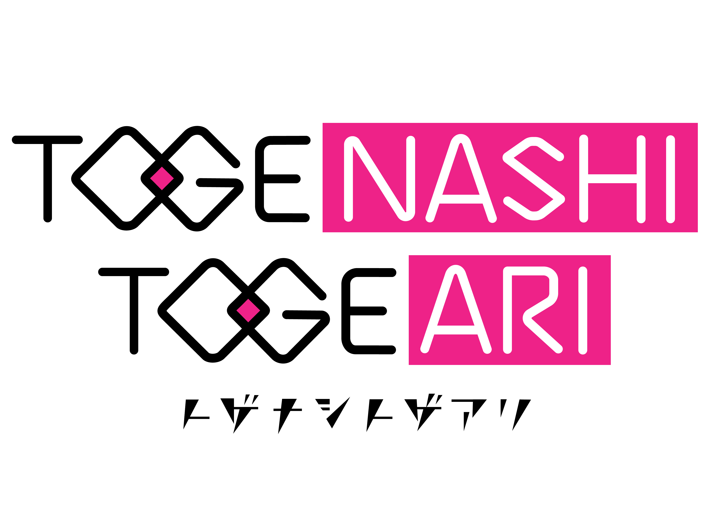
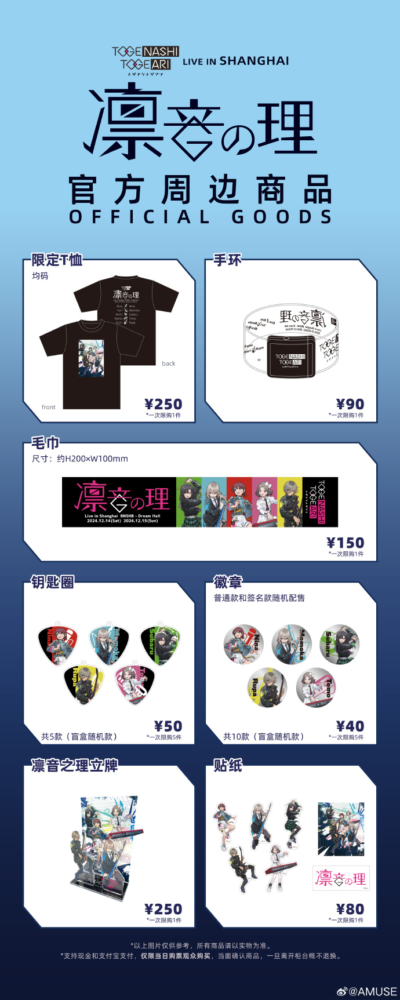

# TOGENASHITOGEARI上海演唱会  快速指南

**VERSION.20241210**

## 特别感谢

**<u>谨代表 `魔都ACGN管理组` 全体成员
由衷感谢以下群体和个人对本指南编写提供的大力支持！</u>**

|                       【排名不分先后】                       |             致谢             |
| :----------------------------------------------------------: | :--------------------------: |
| **魔都ACGN①群、魔都ACGN②群、魔都ACGN③群、魔都ACGN④群、魔都ACGN⑤群小伙伴们** |      意见收集、初审排错      |
|                      **@蓝熠、@Rogers、@酪西瓜**                     | 网站域名、后期运维、技术支持 |
|                     **@沐雪、@诗酒落英**                     |      内容撰写、文档排版      |

## 1. TOGENASHITOGEARI是谁？

TOGENASHI TOGEARI是《GIRLS BAND CRY》及其衍生作品的登场乐队，同时也是企划下的真实女子乐队。

### 乐队历史
在TV动画中，该乐队的前身为新川崎（仮）和beni-shouga（红生姜）。

### 乐队命名
乐队名是仁菜根据现场观众穿着的衣服即兴命名的。现场观众穿着的衣服上写着「トゲアリ（togeari）トゲナシ（togenashi）トゲ（toge）トゲ（toge）」，这是一种名称奇特的昆虫。（日文：トゲハムシ亚科）该昆虫是尖刺（トゲアリ）叶甲（トゲ）虫（トゲ）中无刺（トゲナシ）的变种。由于在日语中同时出现了4个トゲ，成为了一种受大众关注的昆虫，以至于朝日电视台也有一节目系列以这种昆虫命名。

### 乐队形象
图标中的乐队名片假名「トゲナシトゲアリ」刻意营造成带刺的感觉。

## 2、	トゲナシトゲアリ Live in SHANGHAI 『凛音の理』

**TOGENASHITOGEARI上海演唱会** 将在下周六、周日(2024-12-14/15)正式开始，下面为官方的一些信息。这边搬运过来供大家参考。[原文链接](https://weibo.com/2726846733/P3A8hAth8)

### Q：购票观众是否需要携带有效证件？
A：无论是VIP票（纸质票）购票观众还是普通票（电子票）购票观众都需要携带自己的有效证件前往演出场馆。我们重申，演唱会采取强实名制入场规则：所有购票观众在入场时必须做到人证合一（即购票者必须是观演者本人，不可冒名他人，也不可将身份证和纸质票转让给他人）。现场工作人员会进行人证核对，一经发现不匹配情况，我们有权视作非官方渠道购票，并谢绝入场。购票者必须携带购票时登记的本人有效身份证件！如遗失或忘带等导致无法入场，主办方不负相关责任，敬请理解！

### Q：VIP票购票观众几点开始入场？按照什么顺序安排入场？
A：  
- **12月14日场**  
  整队时间：16:45～  
  入场时间：17:30～  
- **12月15日场**  
  整队时间：15:15～  
  入场时间：16:00～  

请持有相应场次VIP票的观众在现场工作人员的指引下，根据上述时间按照纸质票上的入场序号有序排队，到入场时间后依次检票入场。请尽量在入场时间前到达演出场馆，以免错过最佳入场时间（以现场具体情况为准）。

### Q：持普通票（电子票）的观众几点开始入场？按照什么顺序安排入场？
A：持有普通票的观众，在当天入场时间前请在工作人员的指引下，在指定区域有序排队（最终视当天现场情况而定）。当持VIP票的观众入场后，将依次安排在各区域整列的普通票观众检票入场。入口处设有检票人员，并会在排队时核对身份信息，核实无误后扫描身份证或有效身份证件入场。根据当天现场情况，整队开始时间可能会有所调整，敬请理解。  
※普通票入场顺序以当天排队顺序为准；因现场安全问题，也请各位观众不要过早排队，谢绝夜排或代排。

### Q：“见送会”的具体规则是什么？如何进行？
A：“见送会”仅针对VIP票购票观众进行。在当天演出结束后请在VIP票区稍等片刻，现场工作人员会对所持纸质票进行二次验票，在现场指引下有序排队参加“见送会”。因现场场地有限，请普通票购票观众和参加完见送会的VIP票观众结束后勿在场馆大厅内停留，以免造成人群拥堵，感谢理解与配合。

### Q：是否有当日券贩售？
A：目前演唱会门票均已售罄，现场不设当日券贩售。

### Q：当天是否有周边贩售？只有购票者才能购买吗？
A：演出当天设有周边贩售，但仅限持有当天票的观众可以购买。工作人员会对排队周边贩售的观众进行身份核对后方可贩售。具体开始时间、购买规则等详情会在近日发布，请稍等片刻！为避免周边转卖、仿冒等不正当行为，制定以上规则，敬请理解与配合。

### Q：现场有分区吗？
A：VIP票持票观众优先入场，可自由选择站位。一楼前区设有仅限VIP票观众入场的区域，可以选择在此观看。如VIP票观众在开演后入场，也可以进入VIP区域观看演出。

### Q：演出是否禁止拍照？
A：演出过程中严禁摄影、摄像及录音，一旦被工作人员发现，会要求删除相关图片、视频及录音，并有可能请您离场，敬请理解。

### Q：饮料、食物能带入场吗？
A：禁止携带饮料和食物进场；可携带600ml以下矿泉水，场馆内也有饮品贩售。但因安全考虑，如发现有任何违反场馆规定或影响观演的行为，将一律没收并请您离场。

### Q：可以穿cosplay服装入场吗？
A：在合法合规的原则下，我们尊重观众的观演着装，故不做限制。但着装必须不能打扰到周围观众的观演体验，一经发现有影响周围观众的行为，工作人员会前往要求调整。

### Q：观演过程中有什么需要注意的地方吗？
A：现场谢绝任何会影响演出或他人观演的行为。妨碍演出或影响他人观演的应援物、看板、横幅、噪音物、旗帜、强光型荧光棒均禁止携带入场。在场馆内严禁一切危险或有潜在危险存在的行为，如经现场工作人员劝阻无效，会立即要求强制离场，敬请理解。

### 关于送礼物和花篮

### Q：是否可以送花篮？
A：可以。请于当天10:00-12:00送到场馆。  
※祝贺花篮等高度和长度均限制在2.5米以内。若花篮及装饰物的大小超出限制，现场可能出现无法摆置的情况，敬请理解。  
※根据当天情况，摆置场所（大厅、后台等）会有部分调整。  
※请务必于演出结束后主动回收花篮，感谢配合。

### Q：是否可以送礼物？
A：可以。在场馆周边贩售区将设有礼物箱。

## 关于场贩相关信息
整理自微博@AMUSE
[原文链接](https://weibo.com/2726846733/P45alcDPu)
### 商品展示
请参考附图了解商品详情。

### 物贩开始时间
- **12月14日/15日**：物贩从中午12:00开始。

### 排队与行为规范
- 谢绝夜排以及任何给场馆或周围居民造成影响的行为。

### 购买资格与流程
- **上海场物贩**：仅限持有当天票的持票者本人购买。
- **身份核对**：现场物贩区会有工作人员进行身份核对，核实无误后方可购买。
- **理解和配合**：请各位理解和配合相关流程。

### 物贩区域指引
- **现场指引**：具体物贩区域将会有现场指引。
- **微博发布**：或当天通过微博发布相关信息。
- **整队时间**：演唱会当天从10:00开始物贩整队。
- **安全考虑**：如现场人数过多，出于安全考虑将有可能提前整队。

### 抵制非正当流通
- **抵制倒卖**：本场演唱会贯彻抵制倒卖周边、仿冒品等非正当渠道流通。
- **理解和支持**：请各位理解和支持。
- **严禁代买代排**：严禁代替他人购买、代排等行为。

### 限购政策
- **限定T恤、手环、毛巾、贴纸、凛音之理立牌**：每人每次限购1件。
- **盲盒款商品（钥匙圈、徽章）**：每人每次限购5件。

### 售完即止
- 物贩周边数量有限，售完为止，敬请理解。