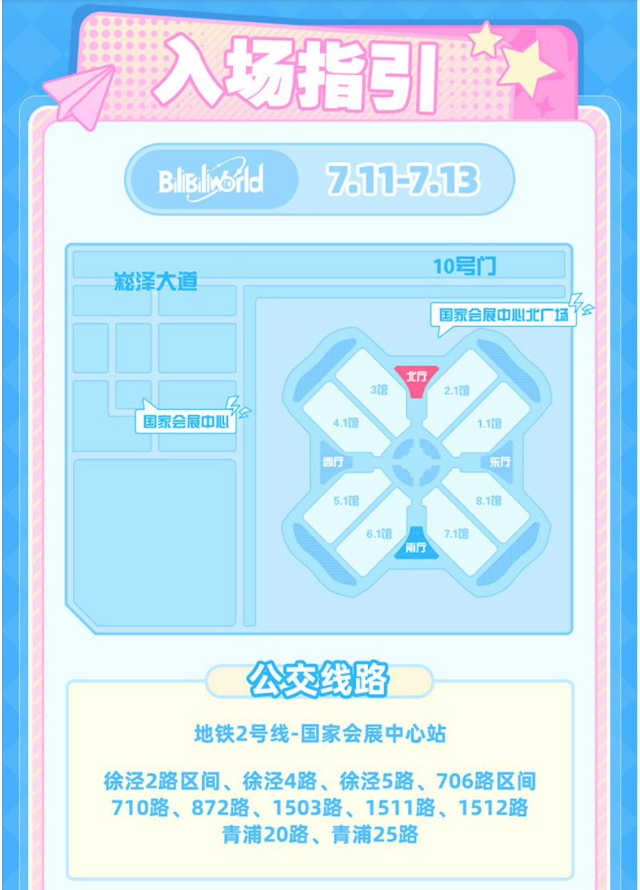

<!--
    =========================
    BW Guide Theme (edit here)
    统一样式：主题色、字号、圆角、阴影、暗色模式都在这里调
    =========================
-->

<!-- =========================
  HERO
========================= -->

# BILIBILI WORLD 2026 新手快速指南
BILIBILI WORLD 2026 初心者向けクイックガイド
<b>版本</b> · v0.6.4 beta

<!-- =========================
  Special Thanks
========================= -->

## #、特别感谢 Special Thanks🎉

  
谨代表 <code>魔都ACGN管理组</code> 全体成员

  由衷感谢以下群体和个人对本指南编写提供的大力支持！

  

    
<code>哔哩哔哩 (゜-゜)つロ 干杯~</code> 弹幕网

    
「再来一杯🍻」

  

  

    
魔都ACGN① - ⑤群小伙伴们

    
意见收集、用户初审

  

  

    
@红暮、@Rogers、@酪西瓜

    
网站运维、技术支持

  

  

    
@沐雪、@诗酒落英、@潘未来

    
内容撰写、文档排版

  

<!-- =========================
  0 Preface
========================= -->

## 0、写在前面 冒頭にあたって

又到了一年一度 <code>BW</code> 展会举办前夕，各种官方与非官方消息铺天盖地，到处充斥着所谓 <code>内部人士</code>、<code>保安队长</code>、<code>XX我表哥/亲戚</code>、<code>叔叔阿姨的私生子</code>、以及<code>不知名志愿者招募团</code> 等的小道消息，给尚未参加过大型漫展的新手小伙伴，甚至一些常年混迹于各地漫展的老司机带来了大量困惑。

鉴于此，在群主 [@是瓜子酱](https://space.bilibili.com/80667791) 的授意下，<code>魔都ACGN管理组</code> 起草并收集了目前大部分渠道公开且已经过验证的指南信息，供大家参考。

随着官方逐步公开更多信息，指南中部分内容可能会过时。我们会为「随时间推移可能变动的信息」进行特殊标识（示例）：

  

    

      
✨最新进展

      
2026.02.24 ~

    

    

      瓜子女装项目已完成整体设计与样衣制作确认，目前正式进入生产排期阶段。
      预计将于 <b>4月底前完成全部生产交付</b>。
    

  

  

    

      

        
📑历史版本

        
2025.12.21 ~ 2026.02.23

      

      
    

    

      管理组已完成瓜子女装版型设计初稿，并对细节比例进行最终微调与优化；
      原计划于农历新年后进入生产阶段。
      
注：此内容为历史记录，可能已不适用于最新版本。

    

  

 

指南编写涉及众多，虽已经过管理组的细心校对，但仍难免出现疏漏，恳请您不吝指出，以便我们及时改进，感谢您的理解与支持！

相见的鼓点越来越清晰，我们也即将在这个初夏一起欢聚，一起狂欢，愿我们共同享受这场属于每个人的青春盛宴，期待与各位相见！！

<!--
    =========================
    1 What is BW
    =========================
-->

## 1、BW是什么？ BWとは？

    

        BW全称 <code>BILIBILI WORLD</code>。是一场由B站主办的，以 <code>ACGN文化</code> 为主题的大型线下活动，致力于拉进创作者和粉丝的距离，为所有ACGN文化爱好者提供沉浸式体验的场景和线下交流的平台。
    

    

        BWの正式名称は「BILIBILI WORLD」。
        Bilibili主催の<code>ACGN文化</code> 総合イベントで、クリエイターとファンをつなぐ大型リアルイベントです。
        来場者に没入感のある体験と交流の場を提供しています。
    

  
一句话总结

  简答来说，就是一个 <b>商业漫展</b>。

  

    

      
⚠️重要提醒

      
2025.12.23 ~

    

    

      <b>关于 BW2026 的参与提醒</b>
      <ul>
        <li>因日本首相高市早苗 2025 年末发表涉台、涉华错误言论，严重伤害民族感情，国内多地漫展、线下演唱会已全面移除涉日相关内容，部分日方 IP、嘉宾、舞台与周边均做下架或取消处理。</li>
        <li>受整体氛围与监管要求影响，BW2026 存在内容调整、日方环节缩减或取消的可能性，目前官方尚未发布最终方案。</li>
      </ul>
      <b>重要提醒</b>
      <ul>
        <li>请理性看待内容调整，以官方通知为准，不信谣不传谣。</li>
        <li>参展、cos、周边创作请避开敏感日方 IP 与争议内容，遵守现场规定。</li>
        <li>我们会持续同步 BW2026 最新消息，提醒大家合理安排行程与准备。</li>
      </ul>
      <b>热爱不分立场，底线必须坚守。感谢大家的理解与配合。</b>
    

  

<!--
    =========================
    2 Ticket time
    =========================
-->

## 2、什么时候开票？ チケット販売期間

    

        每年 <code>BW</code> 的举办时间相对固定，一般为暑期7月分前后，开票时间为活动举办日的 <b>前2周</b>。
        BWは例年7月前後に開催され、チケットは開催日の約2週間前より販売開始となります。
    

    

        BWは毎年おおよそ開催時期が固定されており、
        一般的に夏季（7月前後）に開催されます。
        チケットの販売開始は、通常イベント開催日の約2週間前となります。
    

<table class="bw-table">
    <thead>
        <tr>
            <th class="center">年份</th>
            <th class="center">举办时间</th>
            <th class="center">城市</th>
            <th class="center">举办地点</th>
            <th class="center">备注</th>
        </tr>
    </thead>
    <tbody>
        <tr class="row-green">
            <td class="center"><b>2026</b></td>
            <td class="center">2026.07.10 - 07.12</td>
            <td class="center">上海</td>
            <td>国家会展中心（上海）</td>
            <td class="center"><b>预计</b></td>
        </tr>
        <tr class="row-yellow">
            <td class="center"><b>2025</b></td>
            <td class="center">2025.07.11 - 07.13</td>
            <td class="center">上海</td>
            <td>国家会展中心（上海）</td>
            <td class="center">已举办</td>
        </tr>
         <tr class="row-gray">
            <td class="center"><b>2024</b></td>
            <td class="center">2024.07.12 - 07.14</td>
            <td class="center">上海</td>
            <td>国家会展中心（上海）</td>
            <td class="center">已举办</td>
        </tr>
    </tbody>
</table>

    

        2026年 <code>BW</code> 开票消息公布后我们也会第一时间在各个群内通知，请各位稍安勿躁，不要传播未经证实的消息哦。
    

    

        2026年BWのチケット販売情報が正式に発表され次第、当管理チームも各チャットコミュニティにて速やかにお知らせいたします。
        どうか落ち着いてお待ちいただき、未確認の情報を拡散しないようお願いいたします。
    

<!--
    =========================
    3 Ticket types
    =========================
-->

## 3、票价多少，有哪几个票种？ チケットの種類・価格一覧

<!-- BW在2023年经历了一次价格和票种调整，本说明仅参考去年售票情况做出解答。 -->

<table class="bw-table">
  <thead>
    <tr>
      <th class="center">票种 （券種）</th>
      <th class="center">价格 （価格）</th>
      <th class="center">福利 （特典内容）</th>
      <th class="center">备注 （備考）</th>
    </tr>
  </thead>
  <tbody>
    <tr>
      <td class="center">
        <b>VIP票</b> 
        <b>VIP</b>
      </td>
      <td class="center">588元 </td>
      <td class="center">
        包含限定纪念礼包（单日限定主题盒蛋、镭射票、吧唧等）；专属入场通道，提早入场；可进入舞台最前方VIP区域观看表演；免费寄存包裹，等等... 
        限定記念ギフト（当日限定テーマボックスフィギュア、ホログラムチケット、缶バッジなど）付き。専用入場レーンから優先入場可能。ステージ最前方のVIPエリアで観覧可。手荷物無料預かりサービスあり、ほか多数。
      </td>
      <td class="center">
        数量极其稀少；抢到就是赚到；富哥专属！ 
        数量は非常に限定的。入手できれば超ラッキー！
      </td>
    </tr>
    <tr>
      <td class="center">
        <b>IP典藏票</b> 
        <b>IP限定特典付き
        チケット</b>
      </td>
      <td class="center">328元 </td>
      <td class="center">
        包含IP联动实物特典（镭射票根、IP周边等），需入场后前往指定场馆摊位排队换取。 
        IPコラボ実物特典（ホログラム半券、IPグッズなど）付き。入場後、指定ブースにて引き換えが必要。 
        典藏票与普通票的入场时间、入口均一致。 
        入場時間および入口は一般チケットと同一です。
      </td>
      <td class="center">
        如果这个IP是你的最爱，那么太棒了！这世界上怎会有这么美好的事情！ 
        推しIPが入っているなら、買わない理由はもうありませんよね？
      </td>
    </tr>
    <tr>
      <td class="center">
        <b>普通票（游园票）</b> 
        <b>一般チケット</b>
      </td>
      <td class="center">128元 </td>
      <td class="center">
        无 
        特典なし
      </td>
      <td class="center">
        组成了漫展的 <code>大多数</code> 
        来場者の<code>大多数</code>を占める基本チケット
      </td>
    </tr>
    <tr>
      <td class="center">
        <b>纪念联票</b> 
        <b>記念セットチケット</b>
      </td>
      <td class="center">808-1308元 </td>
      <td class="center">
        联票纪念双面防晒渔夫帽 
        セット限定リバーシブルUVカットバケットハット
      </td>
      <td class="center">
        BW单日游园票 +  BML单日 <code>A档</code>/<code>B档</code>/<code>C档</code> 组合 
        BW1日入場券 + BML1日券 <code>A席</code>/<code>B席</code>/<code>C席</code> セット
      </td>
    </tr>
    <tr>
      <td class="center">
        <b>邀请函</b> 
        <b>招待枠</b>
      </td>
      <td class="center">400-1500元 </td>
      <td class="center">
        你将晚于上述所有票种入场 
        上記すべての券種より遅れての入場となります
      </td>
      <td class="center">
        <b>非公开售卖</b>，怨种预定 
        <b>一般販売なし</b>
      </td>
    </tr>
  </tbody>
</table>

  
⚠️重要提醒

  <b>购票纪念联票的用户如现场未领取纪念品的，视为放弃。活动后不予补发。</b>

  
⚠️重要提醒

  <b>BW 购票需要B站用户等级 LV2 及以上的正式会员。</b>

  
⚠️关于邀请函使用的重要说明

    <ul>
        <li>邀请函在 <b>每日10点之后</b> 方可进入，且仅可单次入场。</li>
        <li>邀请函仅限18周岁以上入场。 </li>
        <li><code>BW</code> 采用强实名制入场，一人一票（函）。获得邀请函后，必须在参展日 <b>前一天18点前</b> 通过 <code>微信</code> 或 <code>哔哩哔哩APP</code> 扫码录入证件信息。入场需携带有效且与登记一致的证件及邀请函本体。</li>
        <li>邀请函无法绑定 <code>【BW乐园】</code>，即 <b>无法参与BW预约活动和打卡抽奖活动</b>。</li>
   </ul>

<!--
    =========================
    4 Where to buy
    =========================
-->

## 4、去哪里买票？ チケット購入方法（オンライン）

购票请认准 <code>BILIBILI会员购</code>，具体进入方式分为 <code>【网页端/Web端】</code> 与 <code>【移动端/手机端】</code>。

  
注意

  iPad等移动端的BILIBILI应用程序没有会员购入口；这些设备如需购票，请参考【网页端/Web端】。

- **【网页端/Web端】**：浏览器进入：[bilibili会员购](https://show.bilibili.com/platform/home.html)，顶部搜索框输入关键词【bilibiliworld】或【bw】即可搜索到对应购票链接，点击进入即可购买。  
- **【移动端/手机端】**：APP底部【会员购】 → 顶部【漫展演出】→ 搜索【bilibiliworld】或【bw】。

  
提醒

  从2024年开始，BW门票<code>大会员提前批</code>、<code>当日晚第一批</code>以及稍晚些时间的<code>第二批开票</code>，均不再支持网页端购票。

<!--
    =========================
    5 Tips
    =========================
-->

## 5、抢票小Tips Tips

1) <b>再次提醒：购票需要B站用户LV2等级及以上的正式会员。</b>  
2) 每个B站账号可登记多个实名制信息（系统对“姓名+身份证号”真实性校验）。  
3) BW单日场次每个账号每天最多购买4张。  
4) 大概率支持期限内退票；临近开展时间手续费比例不等（20%-80%）；开展前3日内一般不支持退票。  
5) 新手抢票可参考： [【保姆级！BW2024抢票攻略！！！-哔哩哔哩】](https://b23.tv/xLWpZkJ)

<!-- =========================
  6 Minor
========================= -->

## 6、关于未成年购票 Minor

  
漫展千万场，安全每一场！

自2024年开始，未成年购票政策可能有重大调整，参考如下（以官方最新为准）：

> - a. 14周岁以上（有效身份证明出生日期为2011年7月11日及以前）的用户可购票。  
> - b. 14周岁至未满16周岁（2009年7月11日至2011年7月11日之间）购票成功：需监护人陪同到现场签署《未成年人入场安全承诺书》后方可入场；无监护人陪同不得入场。  
> - c. 16周岁至未满18周岁（2007年7月11日至2009年7月11日之间）购票成功：需线上回传《未成年人入场安全承诺书》。承诺书开展前通过B站私信发送至购票账号；签字后以扫描件/照片上传至：bw2024@sumexpo.com（组委会审核确认）。

<!-- =========================
  7 Dress
========================= -->

## 7、有关着装问题 Dress

同第6点所说，上海四叶草举办的漫展新增了部分要求：活动可能要求购票者向相关责任方登记入场着装信息，需购票APP内提示完成登记方可出票。登记信息仅用于活动安全有序举办，不会公开。

BW2024关于着装要求（参考）：

> 此次BW购票后需在订单页面申报是否Cosplay；审核通过后方可出票。为方便公共交通安检与快速入场，建议Cosplay用户穿便服乘坐公共交通；现场将设更衣间供更换（8.1馆、2.1馆）。

<!-- =========================
  8 Food
========================= -->

## 8、关于饮品和食物 Food

场馆里面有饮料和吃的，但比较贵；可以自己提前备一点：矿泉水、红牛、小面包、士力架等即可。

<!-- =========================
  9 Hotel
========================= -->

## 9、住宿 Stay

住宿可选择在上海国家会展中心、地铁口附近等交通方便的地方订。建议提前订，距离BW开展越近价格越高。  
拼房最好是熟人；预算不高可选青旅和民宿。

<!-- =========================
  10 First time SH
========================= -->

## 10、第一次来到上海？ Shanghai

抓了个沪✌🏻写写。  
看不懂，直接用高德/百度/腾讯导航搜索“上海国家会展中心”，跟着导航走。坐地铁建议去大都会买三日地铁票，无限乘。

<!-- =========================
  11 Transport
========================= -->

## 11、交通方式 Traffic

BW2025入场指引具体细节暂未公布；下面为BW2024入场指引仅供参考，后续会更新。

<table class="bw-table">
  <thead>
    <tr>
      <th>出行方式</th>
      <th>活动内容</th>
      <th>详细说明</th>
    </tr>
  </thead>
  <tbody>
    <tr>
      <td><b>自驾</b></td>
      <td class="center"></td>
      <td>等一个老哥来补充。</td>
    </tr>
    <tr>
      <td><b>网约车/出租车</b></td>
      <td class="center">BW</td>
      <td>
        ① VIP票、邀请函、STAFF、展商、VOLUNTEER：打车至 <b>国家会展中心北广场（崧泽大道）-10号门</b>。 
        ② 普票：打车至 <b>国家会展中心（诸光路）-5/6/7号门</b>，下车后观察/问询排队情况，选择往左（← VIP方向）或往右（→ 普票方向）前行。 
        ※ 由于VIP与普票配票比例约 1:9，普票队伍可能极长，建议不要直接打车至售票页面所示普票最终入口位置，以免找队尾浪费时间。
      </td>
    </tr>
    <tr>
      <td><b>地铁</b></td>
      <td class="center">BW&amp;BML</td>
      <td>
        <b>地铁2号线 - 国家会展中心</b>：沿通道步行至 4/5/6 号口出站。 
        <b>地铁17号线 - 诸光路</b>：沿通道步行至 2号口出站。
      </td>
    </tr>
    <tr>
      <td><b>步行/自行车</b></td>
      <td class="center"></td>
      <td>等一个老哥来补充。</td>
    </tr>
    <tr>
      <td><b>公交车</b></td>
      <td class="center">BW&amp;BML</td>
      <td>徐泾东站(706路区间、710路、872路、1503路、1511路、1512路、青浦20路、青浦25路、徐泾2路区间、徐泾4路、徐泾5路)</td>
    </tr>
  </tbody>
</table>

  
BW2025 入场指引图（来自官方）

  下图为你原文引用：<code>./../../public/mib/bw2025entry-guide.png</code>

  
  
BW2025 入场指引图（官方）

<!-- =========================
  12 Photo
========================= -->

## 12、集邮 Photo

注意事项：不要偷拍；不要化妆时找coser；要尊重老师。coser不容易。  
用手机集邮没问题，最好开美颜（谁都喜欢美）。第一次来不敢集邮可以找群友帮忙，一起集邮，慢慢就熟悉了。

<!-- =========================
  13 Freebies
========================= -->

## 13、无料 Freebie

如果有老师送的无料是食品的话，最好不要吃（害人之心不可有，防人之心不可无）。  
热门IP领无料需要排很久（一个小时以上），做好心理准备。

<!-- =========================
  14 Carry
========================= -->

## 14、随身物品 Carry

以轻量化为主。<b>一定要带身份证（重要的事情说三遍）</b>。  
舒适背包（容量适当）；不出cos没必要带箱子；买谷会给大纸袋；小坐垫即可；没必要露营椅（小折叠塑料椅可以）；可带压缩背包；纸巾；充电宝；入耳/半入耳耳机（单人参展必带），两只耳朵交替戴防止漏消息。

<!-- =========================
  15 Queue
========================= -->

## 15、排队 Queue

一般两种：夜排与正常排。  
夜排指当天凌晨三点左右开始排队（适合舞台早、想占前排、或抢热门无料等）。否则不建议。  
正常排队建议十点以后入场：排队更短，场内气氛更活跃，但游玩时间更短；适合单纯cos或无明确目标游客。

<!-- =========================
  16 Meet
========================= -->

## 16、签售会/见面会 Meet

一般需要提前预约，详情关注目标UP主的B站动态等待消息。

<!-- =========================
  17 Clothes
========================= -->

## 17、衣着 Clothes

短袖即可；体寒者可带一件防晒衣厚度外套。室内空调很给力。

<!-- =========================
  18 Props
========================= -->

## 18、道具 Props

道具最好使用EVA和PVX管，最好不要超过两米。  
军宅准备的模型不要太逼真，做好无害化处理。

<!-- =========================
  19 Ticket amount
========================= -->

## 19、票的数量 Scale

根据去年总共十万多的票量，今年保守预估十五万左右。

<!-- =========================
  20 VIP?
========================= -->

## 20、大会员推不推荐开？ VIP

除非你有十足把握，我个人建议不开：大会员提前放票非常少，十分不好抢（按去年）。

<!-- =========================
  21 BW vs BML
========================= -->

## 21、BW是否和BML冲突 Schedule

BW是漫展：上午八点半到下午五点。  
BML是演唱会：下午六点到晚上十点。  

此外，自2024年开始，BML改为在国家会展中心（虹馆）举办，~~还我梅菜篮子~~，更不用担心冲突。

<!-- =========================
  22 Guests
========================= -->

## 22、嘉宾列表没有的UP会不会去BW Guests

关注你喜欢UP主的抖音、微博、B站、小红书等账号，通常会有行程安排。

<!-- =========================
  23 Photo/MUA/Wig
========================= -->

## 23、关于摄影和妆娘，毛娘 Services

群里有摄影老师和妆娘、毛娘，可在群内约。  
也可以去咸鱼、小红书、抖音、B站等约摄影师/毛娘/妆娘。  

各位coser注意防骗：约摄影师先看场照、正片、价格、是否修图等；约妆娘毛娘同理。

<!-- =========================
  24 Places
========================= -->

## 24、逛完漫展或者10号14号在上海推荐去哪些二次元浓厚的地方 Places

逛完漫展最好在宾馆休息。精力充沛可去：  
- 南京东路百联ZX、百米香榭吃谷  
- 上海金桥拉拉宝都看高达  
- 汶水路附近EVA主题公园（建议下午五六去）

<!-- =========================
  25 Storage
========================= -->

## 25、关于存包 Storage

场馆内可以存包。按去年：普票存包20，VIP免费，先到先得。  
VIP票优先；普票满了VIP依旧可存。无论VIP还是普票都只可以存一个包。  
<b>VIP福袋不可以寄存。</b>

<!-- =========================
  26 Restroom
========================= -->

## 26、场馆内盥洗室位置 Restroom

往期（2024）年BW公众开放场馆内盥洗室布局如下图所示。  
届时展会内会存在许多高大立牌遮挡方位，难以快速定位，建议保存以备不时之需。

  
提醒

  不排除个别盥洗室因为安全问题最终并未开放；请预留充足找寻时间，避免意外。

※图还在制作，先占位放一下：  

 <!-- bw-wrap end -->
